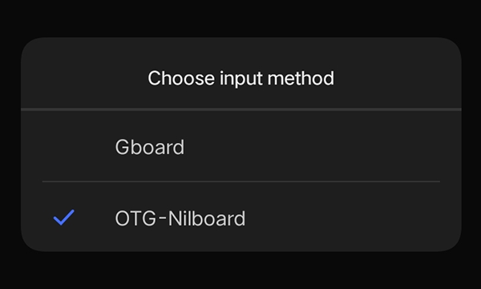

# OTG-Nilboard
Android smartphone app to suppress the default keyboard.

## About the Project
This project is exclusively for Android smartphones only. I made this keyboard app the does nothing so that bluetooth and/or OTG physical keyboard users would be able to hide the Android phone's on-screen keyboard.

OTG-Nilboard keyboard literally does nothing and shows nothing, and is purposively made for bluetooth and/or OTG keyboard users as mentioned previously.

Check my other projects out at [nthnn.github.io](https://nthnn.github.io).